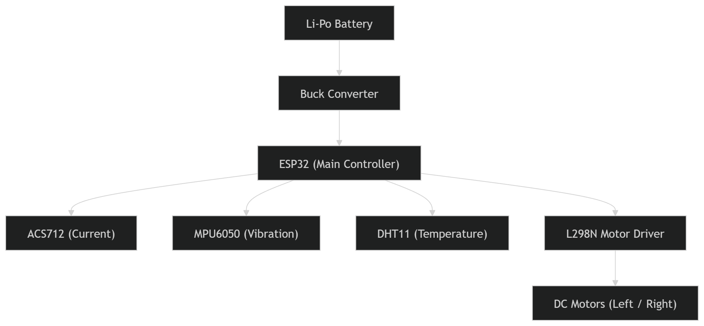
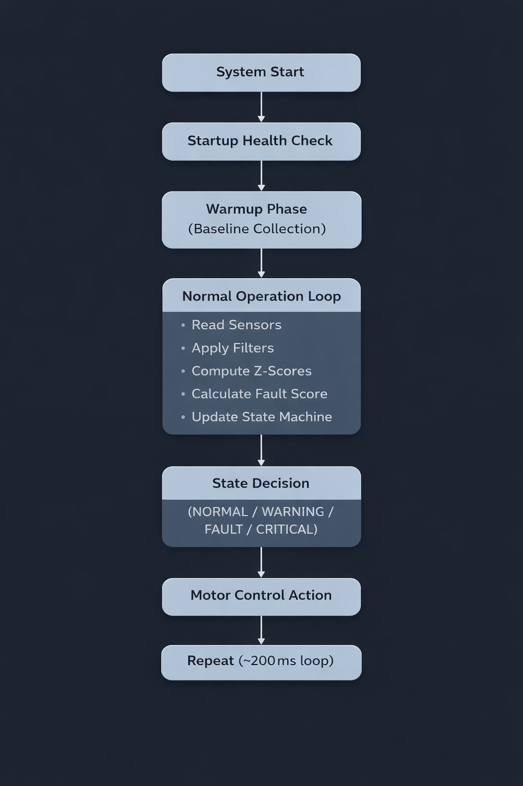
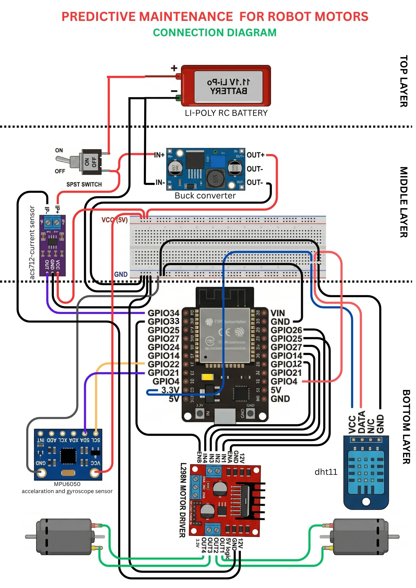

Predictive Maintenance Robot using ESP32 and Multi-Sensor Fault Detection

1. Introduction

This project presents a real-time predictive maintenance system implemented on a 2WD mobile robot using an ESP32 microcontroller. The objective is to detect motor faults reliably under real-world conditions without relying on static datasets or pre-trained machine learning models.

The system continuously monitors motor behavior using multiple sensors and identifies anomalies by comparing real-time data against a dynamically learned baseline. Based on the severity of detected deviations, the system automatically adjusts motor operation to prevent damage.

2. Problem Statement

Initial attempts focused on building a machine learning model using collected datasets under three operating conditions:

Normal
Moving
Blocked

While this approach worked in controlled conditions, it failed during repeated real-world testing. The primary issue observed was sensor drift, especially in current readings. The same motor produced different values across sessions due to variations in battery voltage, load conditions, and environmental factors.

This made the prebuilt dataset unreliable, as the trained model could not generalize to new conditions.

3. Key Design Shift

To overcome these limitations, the approach was redesigned.

Instead of training a model on fixed data, the system now:

Learns its own “normal” behavior at runtime
Uses statistical methods to detect deviations
Eliminates dependency on pre-collected datasets

The prebuilt dataset was not discarded entirely; it was used to understand the approximate operating range of sensor values. However, it is not used for real-time decision-making.

4. System Architecture
Hardware Components

The system is built using the following components:

ESP32 microcontroller
L298N motor driver
2WD robot chassis with DC motors
ACS712 current sensor
MPU6050 accelerometer (vibration detection)
DHT11 temperature sensor
Buck converter for voltage regulation
Li-Po battery power supply
Functional Layers

The system can be logically divided into three layers:

Control Layer
Handles motor control using PWM signals from the ESP32.

Sensing Layer
Collects real-time data from current, vibration, and temperature sensors.

Processing Layer
Performs filtering, baseline learning, anomaly detection, and decision-making.

5. Development Process
Step 1: Basic Robot Implementation

A differential drive 2WD robot was built and controlled using the ESP32. Initial validation ensured stable motor control, proper power distribution, and reliable communication.

Step 2: Current Monitoring

The ACS712 current sensor was integrated to measure motor load. Data collection revealed that current values varied significantly between runs, even under similar conditions.

Step 3: Machine Learning Attempt

A dataset was created using different operating states and used to train a model. However, due to inconsistent sensor behavior, the model failed to provide reliable predictions.

This step was critical in identifying the limitations of static ML approaches in embedded systems with variable hardware conditions.

Step 4: Multi-Sensor Integration

To improve reliability, additional sensors were introduced:

MPU6050 for vibration analysis
DHT11 for temperature monitoring

This enabled a multi-dimensional understanding of motor health.

Step 5: Adaptive Baseline Implementation

A warmup phase was introduced at system startup. During this phase, the robot operates under assumed normal conditions and collects sensor data.

From this data, the system computes:

Mean (average value)
Standard deviation (natural variation)

This baseline represents the normal operating condition for that specific session and remains fixed during operation.

6. Core Detection Method
Z-Score Based Anomaly Detection

The system uses statistical normalization to evaluate deviations:

Z = (current_value - baseline_mean) / baseline_std_dev

This value represents how far a reading deviates from normal behavior.

Small values indicate normal operation
Large deviations indicate potential faults
Positive and negative values are both meaningful for current analysis
7. Noise Reduction Techniques

Raw sensor data contains noise that can lead to false detections. Two filtering techniques are used:

Median Filter (Vibration): Removes sudden spikes effectively
Moving Average (Current): Smooths short-term fluctuations

These filters ensure that only consistent anomalies are considered.

8. Fault Scoring Mechanism

A unified fault score is computed using weighted contributions from sensors:

fault_score = (Z_current × 0.5) + (Z_vibration × 0.5)

Additional adjustments:

Multi-sensor anomalies increase confidence
Sudden spikes are given extra weight

This scoring system allows gradual classification of system health instead of binary decisions.

9. State Machine for Decision Making

To avoid false positives, the system uses a state machine with persistence logic.

States:
WARMUP
NORMAL
WARNING
FAULT
CRITICAL

A fault is only confirmed if abnormal readings persist across multiple cycles. Similarly, recovery requires sustained normal behavior.

This ensures stability and prevents reactions to transient noise.

10. Fault Interpretation

The system identifies different types of faults based on sensor behavior:

Overcurrent: Indicates overload or blockage
Low Current: Suggests disconnection or driver issues
High Vibration: Points to mechanical instability
Sudden Spike: Detects abrupt failures
Multi-Sensor Fault: Strong indication of serious failure

Each type provides insight into the physical condition of the robot.

11. System Workflow

The complete process runs continuously on the ESP32:

Sensor data acquisition
Signal filtering
Baseline comparison
Z-score computation
Fault scoring
State transition
Motor control action

This loop executes approximately every 200 milliseconds.

12. Key Observations
Sensor values are not stable across sessions
Fixed thresholds are ineffective
Prebuilt datasets have limited real-world applicability
Adaptive systems provide significantly better reliability
13. Advantages of the Approach
No dependency on machine learning models
Fully real-time and hardware-adaptive
Robust against noise and transient spikes
Computationally efficient (runs entirely on ESP32)
Scalable to additional sensors
14. Limitations
Baseline accuracy depends on correct warmup conditions
DHT11 has limited precision and slow response
Long-term degradation tracking is not implemented
No cloud-based monitoring or logging
15. Future Improvements

The current system provides a strong foundation for real-time fault detection. However, several practical enhancements can further improve reliability and usability:

Battery Monitoring Integration

Add an additional current sensing mechanism to monitor overall battery consumption. This can be used to estimate remaining charge and trigger alerts or actions when the battery level drops below a safe threshold, ensuring timely recharging and preventing unexpected shutdowns.

Buzzer-Based Alert System

Integrate a buzzer to provide immediate audible feedback during critical fault conditions. This ensures that severe issues are noticeable even without monitoring the dashboard, improving safety and response time.

16. Conclusion

This project demonstrates a shift from a traditional machine learning approach to a more practical, adaptive system suitable for embedded environments.

By allowing the system to define its own baseline and detect deviations in real time, the solution becomes more robust, scalable, and aligned with real-world predictive maintenance principles.

17.SYSTEM ARCHITECTURE DIAGRAM
______________________________

18.SYSTEM FLOWCHART
___________________

19.CONNECTION DIAGRAM
_____________________

20. Conclusion

This project demonstrates a shift from a traditional machine learning approach to a more practical, adaptive system suitable for embedded environments.

By allowing the system to define its own baseline and detect deviations in real time, the solution becomes more robust, scalable, and aligned with real-world predictive maintenance principles.
